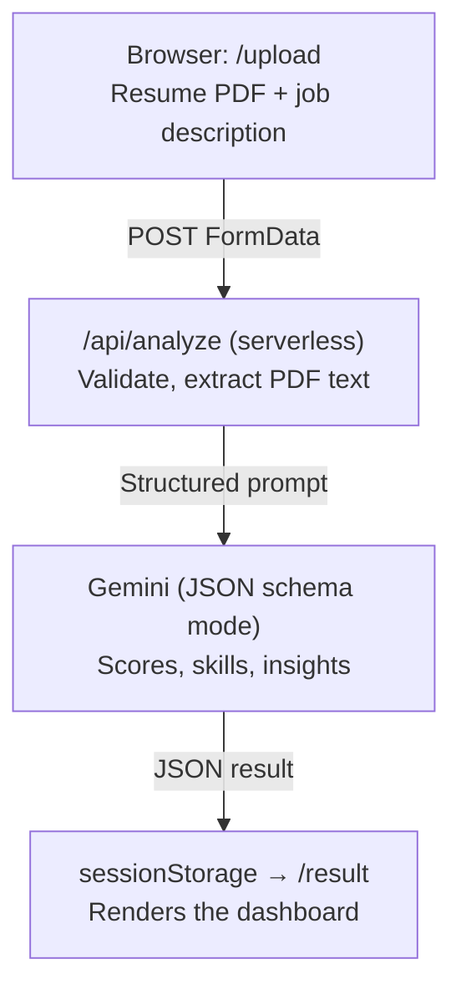
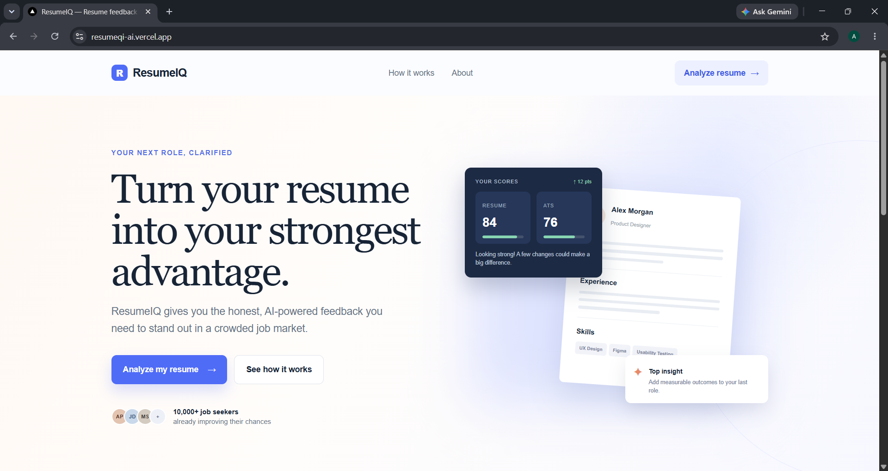
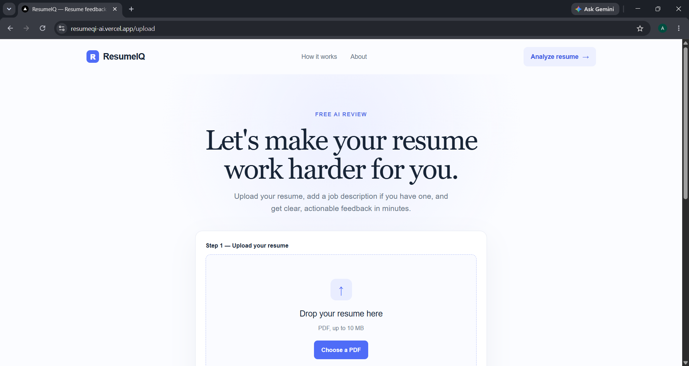
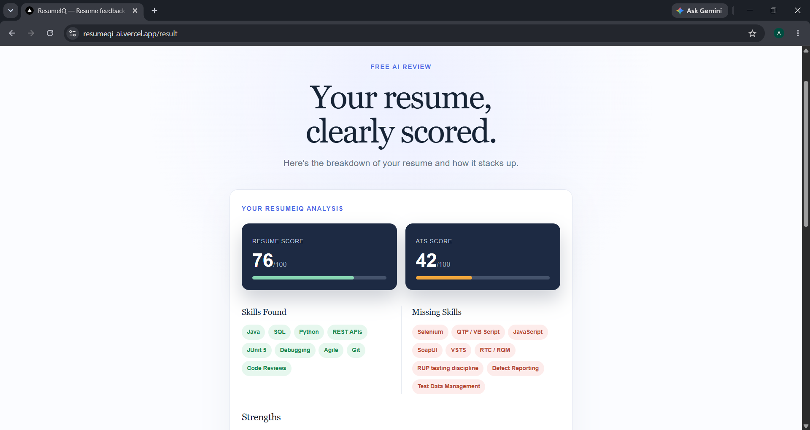

# ResumeIQ AI

AI-powered resume feedback tool. Upload a resume (PDF), optionally paste a job description, and get back a structured analysis: a Resume Score, an ATS (Applicant Tracking System) compatibility score, matched and missing skills, and concrete strengths, weaknesses, and suggestions — all generated by Google's Gemini model.

**Business value:** job seekers get fast, specific, actionable feedback on their resume instead of generic advice — and, when a job description is supplied, a tailored read on how well their resume matches that specific role, closing the gap between "submit and hope" and an informed application.

---

## Features

- **PDF resume upload** with client- and server-side validation (file type, 10 MB size limit)
- **Optional job description input** for a tailored match analysis; general resume feedback if omitted
- **Structured AI analysis** via Gemini's JSON schema mode — no fragile prose parsing, just typed data:
  - `resumeScore` — overall resume quality (0–100)
  - `atsScore` — how well an ATS would parse and rank the resume (0–100)
  - `skillsFound` / `missingSkills`
  - `strengths` / `weaknesses` / `suggestions`
- **Dedicated results dashboard** (`/result`) with score tiles, color-coded skill pills, and bulleted insight lists
- **Automatic retry** on transient Gemini `503` (model overloaded) errors
- **Responsive design** matching a consistent visual system (Georgia serif headings, Arial body, defined color tokens)

## Tech stack

- **Framework:** Next.js (App Router, Turbopack)
- **Language:** TypeScript
- **Styling:** Plain CSS with Tailwind's base layer (`@import "tailwindcss"`) and custom design tokens
- **AI:** Google Gemini (`@google/genai`), structured JSON output
- **PDF parsing:** `pdf-parse`
- **Deployment:** Vercel, via GitHub Actions CI/CD

## Project structure

```
src/
  app/
    page.tsx              # Homepage
    layout.tsx             # Root layout (header/footer)
    globals.css            # Design system + component styles
    upload/
      page.tsx             # Upload resume + job description (single page)
    result/
      page.tsx             # Displays the analysis dashboard
    components/
      ResultDashboard.tsx  # Shared dashboard UI (score tiles, skills, insights)
    api/
      analyze/
        route.ts           # POST endpoint: parses PDF, calls Gemini, returns structured result
```

## Architecture



No database or auth: the analysis result is passed from `/upload` to `/result` via `sessionStorage`, not a persisted session. This keeps the backend stateless, at the cost of results not being shareable via link or revisitable after the tab closes.

## Screenshots

<!-- Add screenshots to a `docs/screenshots/` folder in the repo, then reference them below, e.g.: -->
<!--  -->
<!--  -->
<!--  -->

## Getting started

### Prerequisites
- Node.js 20+
- A Gemini API key ([Google AI Studio](https://aistudio.google.com/))

### Setup

```bash
git clone <your-repo-url>
cd ResumeIQ-AI
npm install
```

Create `.env.local` in the project root:

```
GEMINI_API_KEY=your_key_here
```

### Run locally

```bash
npm run dev
```

Visit `http://localhost:3000`.

### Build for production

```bash
npm run build
npm run start
```

## How it works

1. User uploads a PDF resume (and optionally pastes a job description) on `/upload`.
2. The client sends both as `FormData` to `POST /api/analyze`.
3. The server validates the file, extracts text from the PDF, and sends a prompt to Gemini with a strict JSON response schema (score fields, skill arrays, insight arrays).
4. The structured result is returned to the client, stored in `sessionStorage`, and the user is redirected to `/result`.
5. `/result` reads the stored analysis and renders it via the shared `ResultDashboard` component.

## Deployment / CI-CD

This project deploys to **Vercel** via a **GitHub Actions** pipeline (`.github/workflows/deploy.yml`):

1. On every push or pull request to `main`, the pipeline installs dependencies, lints, and builds the project.
2. On a push to `main` (after the build succeeds), the pipeline deploys to Vercel in production mode using the Vercel CLI.

### Required GitHub repository secrets

| Secret | How to get it |
|---|---|
| `VERCEL_TOKEN` | Vercel dashboard → Settings → Tokens → Create |
| `VERCEL_ORG_ID` / `VERCEL_PROJECT_ID` | Run `vercel link` locally once; these are written to `.vercel/project.json` |

Also set `GEMINI_API_KEY` as an environment variable in the Vercel project dashboard (Settings → Environment Variables) so it's available at runtime in production.

## Notes

- PDF text extraction may occasionally log a non-fatal `Setting up fake worker failed` warning from `pdf-parse`'s underlying `pdfjs-dist` dependency in local dev; the app automatically falls back to sending the PDF directly to Gemini as an attachment in that case, so analysis still completes successfully.
- Gemini `503 UNAVAILABLE` (temporary model overload) responses are retried automatically once before surfacing an error to the user.
